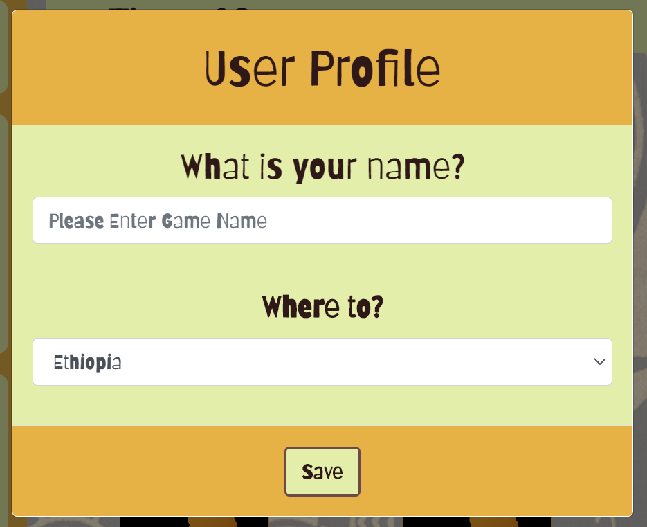
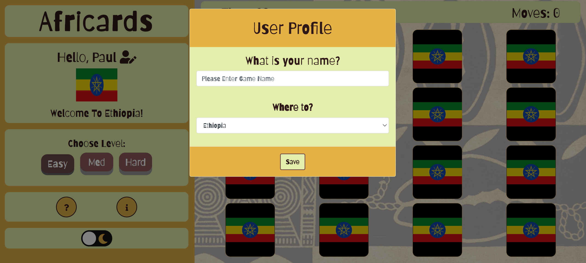
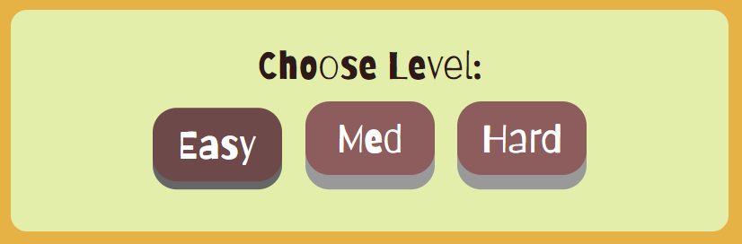
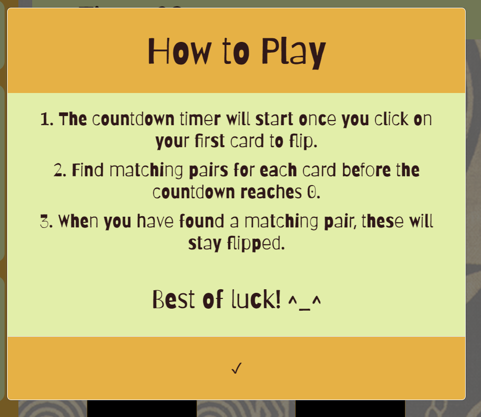
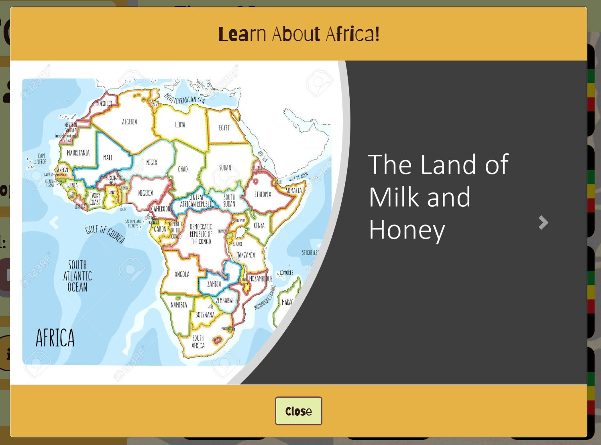
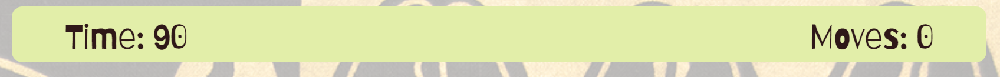
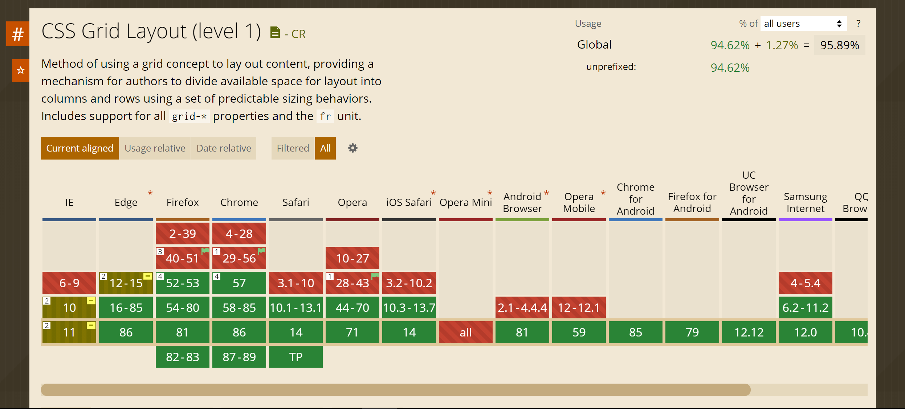
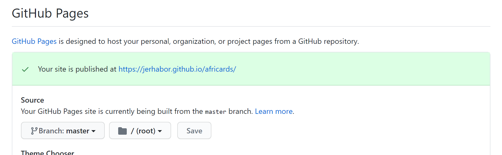

 
# Africards 

  * [1. User Experience - UX](#1-user-experience---ux)
    + [1.1. User Stories](#11-user-stories)
    + [1.2. Structure and Skeleton Phases](#12-structure-and-skeleton-phases)
  * [2. Features](#2-features)
    + [2.1. Features](#21-features)
      - [2.1.1 User Profile Modal](#211-user-profile-modal)
      - [2.1.2 Level Buttons](#212-level-buttons)
      - [2.1.3 Key Information Buttons](#213-key-information-buttons)
      - [2.1.4 Light / Dark Mode Toggle Switch](#214-light---dark-mode-toggle-switch)
      - [2.1.5 Game Play Information](#215-game-play-information)
      - [2.1.6 Game Cards Container](#216-game-cards-container)
      - [2.1.7 Game Lose](#217-game-lose)
      - [2.1.8 Game Win](#218-game-win)
    + [2.2. Features Left to Implement](#22-features-left-to-implement)
  * [3. Technologies Used](#3-technologies-used)
  * [4. Testing](#4-testing)
    + [4.1. Testing Features](#41-testing-features)
    + [4.2. User Feedback:](#42-user-feedback-)
      - [User Feedback](#user-feedback)
    + [4.3. Code Validation](#43-code-validation)
    + [4.4. Test on Different Browsers](#44-test-on-different-browsers)
    + [4.5. Test on Different Devices](#45-test-on-different-devices)
    + [4.6. Bugs and Problems](#46-bugs-and-problems)
      - [4.6.1 Solved bugs and problems](#461-solved-bugs-and-problems)
      - [4.6.2 Unsolved bugs and problems](#462-unsolved-bugs-and-problems)
  * [5. Deployment](#5-deployment)
    + [To deploy:](#to-deploy-)
    + [Developing/Editing code:](#developing-editing-code-)
    + [Running file locally](#running-file-locally)
    + [Clone Repository](#clone-repository)
  * [6. Credits](#6-credits)
    + [6.1. Content](#61-content)
    + [6.2. Acknowledgements](#62-acknowledgements)
    + [6.3. Disclaimer](#63-disclaimer)

Africards was birthed in light of the Black Lives Matter movement and in celebration of Black History Month. It is an educational and interactive website. The site hosts a card matching game and provides the opportunity for users to learn about the African Continent.

Holding a whopping 54 countries, Africa stands as the world's second-largest continent. For this first phase of deployment, only six African countries have been added to the game. These have been selected from the different parts of Africa namely:
- North Africa (Morocco)
- East Africa (Ethiopia and Kenya)
- South Africa (also a country)
- West Africa (Nigeria and Ghana)

The website is deployed to GitHub Pages and can be viewed [here](https://jerhabor.github.io/africards/index.html).

## Table of Contents

***

## 1. User Experience - UX

The primary target audience are children, teenagers and young-adults as the educational aspects are quite basic. 

Before the conception of the idea, there were not many culturally-themed games that also provided adequate learning benefits; aside from memory practice. I wanted to create something that is different and adds more value than what was expected. However, I could not put my finger on exactly what just yet.

### 1.1. User Stories

As part of the _Strategy_ plane of UX, I had to consult several potential users to gather their expectations of this project. This allowed me to develop and prioritise ideas to produce something valuable.

**User Story 1:**
> As a school student, I would like to see some quick facts of Africa as it could help me with my history lessons.

**User Story 2:**
> As the parent of a child, I would like the website to be interactive for my child; so that they stay engaged.

**User Story 3:**
> As a young adult, I would like the website to be accessible and responsive on my gadgets namely: tablet, laptop and phone.

**User Story 4:**
> As an adult, I would like to see a variety of pictures showing how culturally rich Africa is.

**User Story 5:**
> As an Africa man, I would like to see different African countries represented in good light as there is so much for the rest of the world to see and hear.

Once I had heard these stories, I compares my ideas to the requirements of the potential users and developed a mindmap to further dive into the site content. Then I made a collection of various African related images and created a moodboard for definite features. You can find all my project development files in a folder which can be viewed [here](https://github.com/jerhabor/africards/tree/master/assets/readme/project-development).

### 1.2. Structure and Skeleton Phases

[Balsamiq Wireframes](https://balsamiq.com/) was used to create the mockups. However, there are limitations to the way I could present information on the wireframe (e.g. unable to use colours, animation etc). Instead, I documented these extra features and progressed with building the base structure of the website by listing out block-commented section headings.

## 2. Features

This section will detail the _Surface_ phase of the project.

[Africards](https://jerhabor.github.io/africards/index.html) has only one page.

### 2.1. Features

#### 2.1.1 User Profile Modal

When it is the user's first time visiting the site, they will be prompted with a modal asking them to provide a game name and select a country from the alloted list. This is compulsory and must be completed in order to play the game.

After the user has submitted their game name and selected their country, these will be stored on their computer. Users are free to change their details anytime by clicking on the icon next to their name. They must provide **both** details for the modal to accept and disappear.

#### 2.1.2 Level Buttons

Africards game consists of three levels:
- Easy
- Medium
- heard

Each level is associated with a timer function that will display the amount of time that the user has to match all cards.

#### 2.1.3 Key Information Buttons

This container comprises to two components:
- A question icon: This loads up a modal and gives the user information on how to play the card game.

- An info icon: This loads up a modal with a carousel which provides the user with key facts of the African countries.

The slides from the carousel to _Learn About Africa_ are available [here](https://github.com/jerhabor/africards/blob/master/assets/readme/learn-about-africa.pdf).

#### 2.1.4 Light / Dark Mode Toggle Switch

This switch enables the user to change colour themes of the site. As mentioned in section 2.2, saving this feature to local storage is due to be implemented.

#### 2.1.5 Game Play Information

This container contains two items:
- Timer: Countdown is initiated when the user clicks to flip their first card.
- Moves: This counts the number of moves that the user makes. For every two cards flipped, the moves count increments by 1.

#### 2.1.6 Game Cards Container

This container uses the CSS Grid to align the cards either by a 4 x 4 format (depending on screen size) or as three columns. The cards comprise of two parts:
- Card-back: This has the flag of the country which is generated from the user profile modal
- Card-front: This shows the image for which the user must find the match.

Once user clicks their first card, the countdown and game are initiated. The level buttons are also disabled.

#### 2.1.7 Game Lose

If the user runs out of time and is unable to match all cards, they will be greeted with a screen-wide "Game Over"

As this `div` takes the whole screen, the user can click anywhere to restart the game.

#### 2.1.8 Game Win

If the user runs out of time and is unable to match all cards, they will be greeted with a screen-wide "Victory"

Like the "Game Over" event, this `div` also takes the whole screen so the user can click anywhere to restart the game.

### 2.2. Features Left to Implement

- African music/sounds effects
- The light and dark mode toggle to be saved in local storage and have animated transitions when clicks.
- A scoring system based on the number of clicks the user makes. The more clicks, the lower their score.

## 3. Technologies Used

- [Git](https://git-scm.com/) - Africards used Git as the version control system during its development.
- [GitPod](https://www.gitpod.io/) - This is an online Integrated Development Environment (IDE).
- [Atom](https://atom.io/) - This is a desktop application built with HTML, JavaScript, CSS, and Node.js integration.
- [HTML5](https://en.wikipedia.org/wiki/HTML5) - HTML stands for Hypertext Markup Language and it is the backbone of Africards. The latest version - HTML5 - was used to add and structure the site content.
- [CSS3](https://en.wikipedia.org/wiki/Cascading_Style_Sheets) - CSS stands for Cascading Style Sheets. The latest version - CSS3 - was used to style all HTML content of Africards as well as style based on JavaScript functionalities.
- [Bootstrap](https://getbootstrap.com/) - Africards uses Bootstrap's grid system to layout site content in a structured manner. The framework also provides some assistance to styling with `class` names.
- [Google Fonts](https://fonts.google.com/) - This font library offers a wide variety of font styles to help with the Africard's brand. This project uses [Barriecito](https://fonts.google.com/specimen/Barriecito).
- [Font Awesome](https://fontawesome.com/) - Africards uses this icon library with its great selection of icons, to improve user experience (UX).
- [JavaScript](https://www.javascript.com) - 
- [Jasmine](https://jasmine.github.io/)
- [JQuery](https://jquery.com/) - Africards uses the JQuery Framework in its script. It also assists Bootstrap functionalities e.g. the loading of modal forms. 
- [Balsamiq](https://balsamiq.com/) - Used to construct my wireframes in the skeleton phase of UX.
- [Mindmup](https://app.mindmup.com/) - Used to brainstorm ideas in the early stages of the project development.

## 4. Testing

### 4.1. Testing Features 

**Fading in of the 'User Profile' modal:**
    - Click on the icon next to user's name.

**Starting the Countdown:**
    - Input country and name
    - Select level
    - Click first card

**Load 'Learn About Africa' modal:**
    - Click the "i" icon

### 4.2. User Feedback:

**User Story 1 feedback:**
> Amazing to quickly learn about all the things Africa offers!

**User Story 2 feedback:**
> Lots of clickable elements, children love to click so I'm happy with this site.

**User Story 3 feedback:**
> Responsive on all devices and is justified and centred well.

**User Story 4 feedback:**
> So colour and I love the background print!

**User Story 5 feedback:**
> Well done on choosing clear images that show how beautiful Africa is!

#### User Feedback

### 4.3. Code Validation
All Code has been validated and you can find screenshots [here](https://github.com/jerhabor/africards/tree/master/assets/readme/validator).

### 4.4. Test on Different Browsers

The site works on multiple browsers, particularly the modern ones. With regards to internet explorer please scroll to section 4.6.

### 4.5. Test on Different Devices

Key: &#x2714; = Displays as intended

|          Device         | Viewport (Width x Height) |   Home   |  Tutors  | Subjects |  Contact |
|:-----------------------:|:-------------------------:|:--------:|:--------:|:--------:|:--------:|
|         Moto G4         |         360 x 640         | &#x2714; | &#x2714; | &#x2714; | &#x2714; |
|        Galaxy S5        |         360 x 640         | &#x2714; | &#x2714; | &#x2714; | &#x2714; |
|        Galaxy S7        |         360 x 640         | &#x2714; | &#x2714; | &#x2714; | &#x2714; |
|         Pixel 2         |         411 x 731         | &#x2714; | &#x2714; | &#x2714; | &#x2714; |
|        Pixel 2 XL       |         411 x 823         | &#x2714; | &#x2714; | &#x2714; | &#x2714; |
|       iPhone 5/SE       |         320 x 568         | &#x2714; | &#x2714; | &#x2714; | &#x2714; |
|       iPhone 6/7/8      |         375 x 667         | &#x2714; | &#x2714; | &#x2714; | &#x2714; |
|    iPhone 6/7/8  Plus   |         414 x 736         | &#x2714; | &#x2714; | &#x2714; | &#x2714; |
|         iPhone X        |         375 x 812         | &#x2714; | &#x2714; | &#x2714; | &#x2714; |
|           iPad          |         768 x 1024        | &#x2714; | &#x2714; | &#x2714; | &#x2714; |
|         iPad Pro        |        1024 x 1366        | &#x2714; | &#x2714; | &#x2714; | &#x2714; |
| Sony Bravia  Television |   55-inch diagonal (4K)   | &#x2714; | &#x2714; | &#x2714; | &#x2714; |

### 4.6. Bugs and Problems

#### 4.6.1 Solved bugs and problems
- Slow loading of page: _Bootstrap_ and _jQuery_ CDN are used so if the user's internet connection is slow, the page could also load slowly. Not intended to affect UX as script is placed at the end of the body element so will only load once the `html` content has been loaded.

- Data from `userProfileModal` seemed to update only after refresh: Countless attempts were made with the assistance of my mentor Caleb, Code Institute Tutors and peers. With the direction of my tutor, I decided that instead of the user having to refresh the page, a `location.reload()` is included on the modal data inputs stored in local storage:

~~~
localStorage.setItem("userCountry", userCountry);
localStorage.setItem("userName", userName);
location.reload();
~~~

The `location.reload()` function takes less than a second, so the user still has the selected country and game name updated after they click save.

#### 4.6.2 Unsolved bugs and problems

Issues with CSS Grid in IE: 
Due to the use of the CSS Grid, the cards do not display as intended in Internet Explorer and much older versions of Firefox because they do not read the `grid-template-columns` property. I initially tried to solve by incorporating:

~~~
-webkit-grid-columns: 1fr 1fr 1fr;
-moz-grid-columns: 1fr 1fr 1fr;
-ms-grid-columns: 1fr 1fr 1fr;
-o-grid-columns: 1fr 1fr 1fr;
~~~

However it came to my attention later on in the project development that the support is modern (as stated in _caniuse_) and this is a commonly recognized bug in software development.

I am now currently looking at how the card structure could be better distributed without the use of grid. This is so that in the next phase of releasing new features; this is included. Currently looking into the use of the [Autoprefixer](https://css-tricks.com/css-grid-in-ie-css-grid-and-the-new-autoprefixer/). 

As this project was developed for educational purposes and intended for modern browsers predominantly used today, it has been a learning experience regarding the general use of css grid, its benefits and its costs.

## 5. Deployment

Africards is deployed to GitHub Pages using its `master` branch; the only available branch at the moment.  
The deployed link is: [https://jerhabor.github.io/africards](https://jerhabor.github.io/africards/).

### To deploy:
- Go to Africards [GitHub repository](https://github.com/jerhabor/africards)
- Click on Settings (above the green _"Clone"_ button)
- Scroll down to **GitHub Pages**
- Under source, select the `master` branch
- The page will automatically refresh and the following will be seen:

### Developing/Editing code:

In the event of making changes to code externally (i.e. not in an IDE workspace such as GitPod), `commit` changes so that you can use `git pull` in the IDE.

When working in GitPod IDE, the process to push to the repository is as follows:
~~~
$ git status
$ git add (insert file name)
$ git commit -m "(classify change and mention why changes were made for this version)"
$ git push
~~~

To track all files/add to storage area all at once, use instead:
~~~
$ git add .
~~~

### Running file locally  

In the IDE terminal, type:
~~~ 
$ python3 -m http.server
~~~

A pop-up box will appear in the bottom-right of the screen:  
  

Click *"Make Public"* so that it is viewable on other devices with the browser link. The following box will now appear:  

Click *"Open Browser"* and a new tab will run the code from the IDE locally.  

**Key Notes:**
* You must save changes in your documents in order to see the reflected product when running locally.  
* Try clearing the browser cache if changes to code do not seem to be running when saved.

### Clone Repository
- Go to Africards [GitHub repository](https://github.com/jerhabor/africards)
- Click on the green _"Clone"_ button and a dropdown will appear. You will see:  
  

You can choose to:
- Copy link to clipboard and paste in the browser address bar.  
- Alternatively, click _"Open in Desktop"_ to use GitHub desktop.

## 6. Credits

**Software Developer: Jess Erhabor**

### 6.1. Content

All images were taken from google and are used for education purposes only.

### 6.2. Acknowledgements

- My mentor [Caleb](https://github.com/calebmbakwe) - for his guidance from conception to deployment.
- [Sammy](https://github.com/SammyDartnall10) the tutor - for her help in directing me to fix some of the bugs in the script.
- My family - for testing the site and providing constructive feedback.
- The Slack community - for the encouragement and general guidance from day one.

### 6.3. Disclaimer

This project was developed for educational purposes only.
