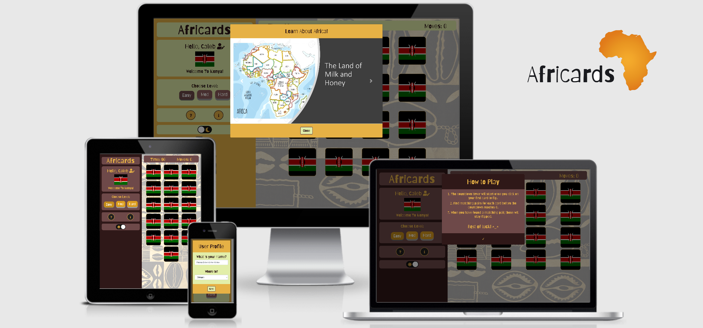

 
# Africards 

Africards was birthed in light of the Black Lives Matter movement and in celebration of Black History Month. It is an educational and interactive website. The site hosts a card matching game and provides the opportunity for users to learn about the African Continent.

Holding a whopping 54 countries, Africa stands as the world's second-largest continent. For this first phase of deployment, only six African countries have been added to the game. These have been selected from the different parts of Africa namely:
- North Africa
- East Africa
- South Africa (also a country)
- West Africa

The website is deployed to GitHub Pages and can be viewed [here](https://jerhabor.github.io/africards/index.html).

## Table of Contents

***

## 1. User Experience - UX

The primary target audience are children, teenagers and young-adults as the educational aspects are quite basic. 

Before the conception of the idea, there were not many culturally-themed games that also provided adequate learning benefits; aside from memory practice. I wanted to create something that is different and adds more value than what was expected. However, I could not put my finger on exactly what just yet.

### 1.1. User Stories

As part of the _Strategy_ plane of UX, I had to consult several potential users to gather their expectations of this project. This allowed me to develop and prioritise ideas to produce something valuable.

**User Story 1:**
> As a school student, I would like to see some quick facts of Africa as it could help me with my history lessons.

**User Story 2:**
> As the parent of a child, I would like the website to be interactive for my child; so that they stay engaged.

**User Story 3:**
> As a young adult, I would like the website to be accessible and responsive on my gadgets namely: tablet, laptop and phone.

**User Story 4:**
> As an adult, I would like to see a variety of pictures showing how culturally rich Africa is.

**User Story 5:**
> As an Africa man, I would like to see different African countries represented in good light as there is so much for the rest of the world to see and hear.

Once I had heard these stories, I compares my ideas to the requirements of the potential users and developed a mindmap to further dive into the site content. Then I made a collection of various African related images and created a moodboard for definite features. You can find all my project development files in a folder which can be viewed [here]().

### 1.2. Structure and Skeleton Phases

[Balsamiq Wireframes](https://balsamiq.com/) was used to create the mockups. However, there are limitations to the way I could present information on the wireframe (e.g. unable to use colours, animation etc). Instead, I documented these extra features progressed with building the base structure of the website by block commenting out section headings in the workspace.

## 2. Features

This section will detail the _Surface_ phase of the project.

[Africards](https://jerhabor.github.io/africards/index.html) has only one page.

### 2.1. Features

### 2.2. Features Left to Implement

- African music/sounds effects
- Light and Dark Toggle animated transitions

## 3. Technologies Used

- [Git](https://git-scm.com/) - Africards used Git as the version control system during its development.
- [GitPod](https://www.gitpod.io/) - This is an online Integrated Development Environment (IDE).
- [Atom](https://atom.io/) - This is a desktop application built with HTML, JavaScript, CSS, and Node.js integration.
- [HTML5](https://en.wikipedia.org/wiki/HTML5) - HTML stands for Hypertext Markup Language and it is the backbone of Africards. The latest version - HTML5 - was used to add and structure the site content.
- [CSS3](https://en.wikipedia.org/wiki/Cascading_Style_Sheets) - CSS stands for Cascading Style Sheets. The latest version - CSS3 - was used to style all HTML content of Africards as well as style based on JavaScript functionalities.
- [Bootstrap](https://getbootstrap.com/) - Africards uses Bootstrap's grid system to layout site content in a structured manner. The framework also provides some assistance to styling with `class` names.
- [Google Fonts](https://fonts.google.com/) - This font library offers a wide variety of font styles to help with the Africard's brand. This project uses [Barriecito](https://fonts.google.com/specimen/Barriecito).
- [Font Awesome](https://fontawesome.com/) - Africards uses this icon library with its great selection of icons, to improve user experience (UX).
- [JavaScript](https://www.javascript.com) - 
- [Jasmine](https://jasmine.github.io/)
- [JQuery](https://jquery.com/) - Africards uses the JQuery Framework in its script. It also assists Bootstrap functionalities e.g. the loading of modal forms. 
- [Balsamiq](https://balsamiq.com/) - Used to construct my wireframes in the skeleton phase of UX.
- [Mindmup](https://app.mindmup.com/) - Used to brainstorm ideas in the early stages of the project development.

## 4. Testing

### 4.1. Testing Features 

### 4.2. Achievement of User Stories

**User Story 1:**

**User Story 2:**

**User Story 3:**

**User Story 4:**

**User Story 5:**

**User Story 6:**

**User Story 7:**

#### User Feedback

### 4.3. Code Validation
**HMTL Code Validation**  

**CSS Code Validation**  

### 4.4. Test on Different Browsers

Key: &#x2714; = Functions well  

### 4.5. Test on Different Devices

Key: &#x2714; = Displays as intended

 ### 4.6. Bugs and Problems

#### 4.6.1. Border on icons button 
Still visible despite being set to none 

#### 4.6.2 Possible slow loading
CDN is used so if internet connection is slow, the page could also load slowly. Not intended to affect UX as script is placed at the end of the body element.

#### 4.6.3. Issues with CSS Grid in IE
Due to the use of the CSS Grid, the cards do not dislay cards well in Internet Explorer and older versions of Mozilla because they do not read the `grid-template-columns` property. I initially tried to solve by incorporating:

~~~
-webkit-grid-columns: 1fr 1fr 1fr;
-moz-grid-columns: 1fr 1fr 1fr;
-ms-grid-columns: 1fr 1fr 1fr;
-o-grid-columns: 1fr 1fr 1fr;
~~~

However it came to my attention that the support is quite scarce. I am now currently looking at how the card structure could be better distributed without the use of grid. This is so that in the next phase of releasing new features; this is included. Currently looking into the use of the [Autoprefixer](https://css-tricks.com/css-grid-in-ie-css-grid-and-the-new-autoprefixer/)

## 5. Deployment

Africards is deployed to GitHub Pages using its `master` branch; the only available branch at the moment.  
The deployed link is: [https://jerhabor.github.io/africards](https://jerhabor.github.io/africards/).

### To deploy:
- Go to Africards [GitHub repository](https://github.com/jerhabor/africards)
- Click on Settings (above the green _"Clone"_ button)
- Scroll down to **GitHub Pages**
- Under source, select the `master` branch
- The page will automatically refresh and the following will be seen:

### Developing/Editing code:

In the event of making changes to code externally (i.e. not in an IDE workspace such as GitPod), `commit` changes so that you can use `git pull` in the IDE.

When working in GitPod IDE, the process to push to the repository is as follows:
~~~
$ git status
$ git add (insert file name)
$ git commit -m "(classify change and mention why changes were made for this version)"
$ git push
~~~

To track all files/add to storage area all at once, use instead:
~~~
$ git add .
~~~

### Running file locally  

In the IDE terminal, type:
~~~ 
$ python3 -m http.server
~~~

The following pop-up box will appear:  
  

Click *"Make Public"* so that it is viewable on other devices with the browser link. The following box will now appear:  

Click *"Open Browser"* and a new tab will run the code from the IDE locally.  

**Key Notes:**
* You must save changes in your documents in order to see the reflected product when running locally.  
* Try clearing the browser cache if changes to code do not seem to be running when saved.

### Clone Repository
- Go to Africards [GitHub repository](https://github.com/jerhabor/africards)
- Click on the green _"Clone"_ button and a dropdown will appear. You will see:  
  

You can choose to:
- Copy link to clipboard and paste in the browser address bar.  
- Alternatively, click _"Open in Desktop"_ to use GitHub desktop.

## 6. Credits

**Software Developer: Jess Erhabor**

### 6.1. Content

### 6.2. Media

### 6.3. Acknowledgements

- My mentor [Caleb](https://github.com/calebmbakwe) - for his guidance from conception to deployment.
- [Sammy](https://github.com/SammyDartnall10) the tutor - for her help in directing me to fix some of the bugs in the script.
- My family - for testing the site and providing constructive feedback.
- The Slack community - for the encouragement and general guidance from day one.

### 6.4. Disclaimer

This project was developed for educational purposes only.
